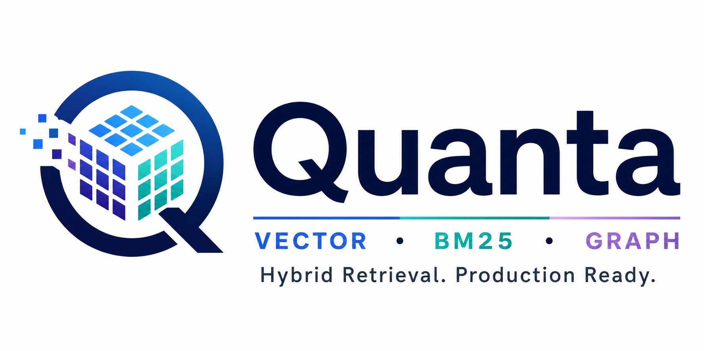

# Quanta


Production-ready hybrid retrieval for Python. Combines 4-bit quantised vector
search (turbovec), optional BM25 full-text search (Tantivy), and optional
Neo4j graph expansion into a single pipeline with a PostgreSQL or DuckDB
document store.



---

## What it does

Quanta retrieves documents using three complementary signals: dense vector
similarity, BM25 keyword relevance, and graph-structural proximity. Vectors are
stored as 4-bit quantised integers via turbovec — **8× less memory than
float32** — without a separate ANN server. The graph is a candidate expander,
not a scorer: it widens the candidate pool by traversing edges from the top
dense hits; final ranking is determined by dense + BM25 scores only. Every
component is optional; `NullGraph`, `NullBM25`, and `NullCache` provide zero-cost
fallbacks so you adopt features incrementally.

---

## Architecture

```
User query (text embedding + optional query_text)
    │
    ├── QuantaIndex("text")   ──┐
    ├── QuantaIndex("images") ──┼── min-max normalise ──► score_map
    └── TantivyBM25           ──┘
                                        │
              top graph_seed_k IDs ◄────┘
                        │
              Neo4jGraph.expand()        ← BFS up to graph_hops steps
              (candidate expander;       ← adds new doc IDs to pool
               does not affect dense    ← graph score = graph_weight × 1/dist
               or BM25 scores)
                        │
              Sort all candidates by score, take top-k
                        │
              DocStore (PostgreSQL / DuckDB) — hydrate content + metadata
                        │
              list[RetrievalResult(id, score, source, content, metadata)]
```

Optional components not shown: `RedisCache` (embedding cache), `EmbeddingCache`
interface, `QuantaVectorStore` (LlamaIndex adapter).

---

## Installation

```bash
pip install quanta                                # core: vector index + DuckDB docstore
pip install "quanta[neo4j]"                       # + Neo4j graph expansion
pip install "quanta[llama-index]"                 # + LlamaIndex VectorStore
pip install "quanta[cache]"                       # + Redis embedding cache
pip install "quanta[bm25]"                        # + Tantivy BM25 search
pip install "quanta[neo4j,llama-index,cache,bm25]" # everything
```

| Extra         | Enables                        |
|---------------|--------------------------------|
| `neo4j`       | `Neo4jGraph` backend           |
| `llama-index` | `QuantaVectorStore` adapter    |
| `cache`       | `RedisCache` embedding cache   |
| `bm25`        | `TantivyBM25` full-text search |
| `duckdb`      | Included in core               |

---

## Quickstart

Zero services. No `.env` required (uses `QuantaIndex` directly).

```python
import numpy as np
from quanta import QuantaIndex

idx = QuantaIndex(name="docs", dim=768, bit_width=4, index_dir="./indexes")

# Add vectors
vectors = np.random.rand(100, 768).astype(np.float32)
ids = [f"doc-{i:03d}" for i in range(100)]
idx.add(vectors, ids)

# Search
query = np.random.rand(768).astype(np.float32)
results = idx.search(query, k=5)
for r in results:
    print(r.id, f"{r.score:.4f}")

# Persist and reload
idx.save()
idx2 = QuantaIndex.load("docs", index_dir="./indexes")
```

**With DuckDB docstore (zero services, full pipeline):**

```python
import asyncio, os
import numpy as np
from quanta import QuantaIndex, DuckDBDocStore, MultiRetriever, NullGraph, QuantaSettings

async def main():
    # POSTGRES_USER and POSTGRES_PASSWORD are always validated — set placeholders
    os.environ.setdefault("POSTGRES_USER", "_unused_")
    os.environ.setdefault("POSTGRES_PASSWORD", "_unused_")
    settings = QuantaSettings(DOCSTORE_BACKEND="duckdb", DUCKDB_PATH="./demo.duckdb")

    docstore = DuckDBDocStore(settings)
    await docstore.init()

    idx = QuantaIndex(name="text", dim=768)
    retriever = MultiRetriever(
        indexes={"text": idx}, docstore=docstore, graph=NullGraph()
    )

    await docstore.add_document("doc-1", "Hello world.", "text")
    await docstore.add_chunk("chunk-1", "doc-1", "Hello world.", 0)
    idx.add(np.random.rand(1, 768).astype(np.float32), ["chunk-1"])

    results = await retriever.search(
        query_vectors={"text": np.random.rand(768).astype(np.float32)}, k=3
    )
    for r in results:
        print(f"[{r.score:.4f}] [{r.source}] {r.content}")

    await docstore.close()

asyncio.run(main())
```

---

## Services (Docker)

```bash
# PostgreSQL only
docker compose up -d postgres

# PostgreSQL + Neo4j (graph expansion)
docker compose --profile graph up -d

# PostgreSQL + Redis (embedding cache)
docker compose --profile cache up -d

# Everything
docker compose --profile graph --profile cache up -d

# Verify all services are healthy
docker compose ps
```

Copy `.env.example` to `.env` and set at minimum `POSTGRES_USER` and
`POSTGRES_PASSWORD`.

---

## Configuration

See [USER_MANUAL.md](USER_MANUAL.md) for the complete variable reference. The
five most important variables:

| Variable            | Default      | Description                                      |
|---------------------|--------------|--------------------------------------------------|
| `POSTGRES_USER`     | *(required)* | PostgreSQL username                              |
| `POSTGRES_PASSWORD` | *(required)* | PostgreSQL password                              |
| `DOCSTORE_BACKEND`  | `"postgres"` | `"postgres"` or `"duckdb"`                       |
| `NEO4J_URI`         | `None`       | Set to `bolt://localhost:7687` to enable Neo4j   |
| `REDIS_HOST`        | `None`       | Set to `localhost` to enable embedding cache     |

---

## Graph-Augmented Retrieval

The graph is a **candidate expander**. Dense search finds semantically similar
documents. Graph traversal finds structurally related documents — ones you know
are connected because you built the relationships (citations, amendments,
interpretations).

```python
import asyncio
import numpy as np
from quanta import QuantaIndex, DocStore, MultiRetriever, Neo4jGraph, QuantaSettings

async def main():
    settings = QuantaSettings()
    docstore = DocStore(settings)
    await docstore.init()

    idx = QuantaIndex(name="text", dim=768)
    graph = Neo4jGraph(
        uri=settings.NEO4J_URI,
        user=settings.NEO4J_USER,
        password=settings.NEO4J_PASSWORD,
    )

    retriever = MultiRetriever(
        indexes={"text": idx},
        docstore=docstore,
        graph=graph,
        dense_weight=0.7,
        graph_weight=0.3,
    )

    # Build graph (one-time indexing step)
    await graph.upsert_node("doc-1", {"title": "GDPR Article 5"})
    await graph.upsert_node("doc-2", {"title": "Court Decision 1234/2021"})
    await graph.upsert_edge("doc-2", "doc-1", "CITES")

    # Hybrid search: dense + 2-hop graph expansion
    results = await retriever.search(
        query_vectors={"text": np.random.rand(768).astype(np.float32)},
        k=10,
        use_graph=True,
        graph_hops=2,
        graph_seed_k=3,
    )
    for r in results:
        print(f"[{r.source}] [{r.score:.3f}] {r.id}")

    # Direct graph navigation
    neighbors = await retriever.navigate("doc-2", relation_type="CITES", hops=1)
    for n in neighbors:
        print(n.id, n.relation, n.distance)

    await docstore.close()
    await graph.close()

asyncio.run(main())
```

See [examples/graph_search.py](examples/graph_search.py) for a complete
runnable example.

---

## LlamaIndex

```python
from quanta.integrations.llama_index import QuantaVectorStore
from llama_index.core import VectorStoreIndex, StorageContext

store = QuantaVectorStore(retriever=retriever, index_name="text", embed_dim=768)
storage_ctx = StorageContext.from_defaults(vector_store=store)
li_index = VectorStoreIndex(nodes=[], storage_context=storage_ctx)
```

`async_add` stores nodes in the docstore and adds their embeddings to the index.
`aquery` delegates to `MultiRetriever.search()`.

---

## Development

```bash
pip install -e ".[neo4j,llama-index,cache,bm25,dev]"
pytest                  # all tests pass without external services
ruff check quanta/
mypy quanta/
```

---

## License

MIT
